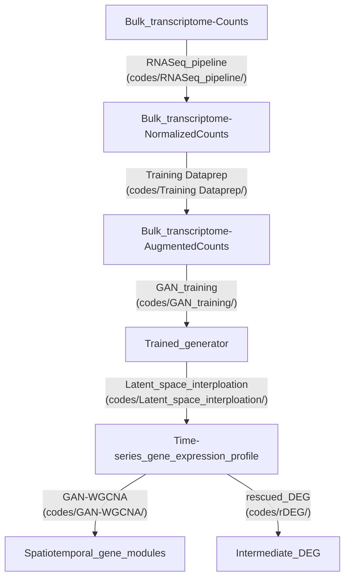

# GAN-WGCNA

## Publication
GAN-WGCNA: calculating gene modules as a way to find key intermediate regulators in cocaine addiction

## Workflow


## Environments
Analyitic scripts are written in python(jupyter notebook) and R. Therefore, installation of interpreter for each language is need. Here is some installation guid
- Python (Jupyter notebook): https://jupyter.org/install and https://docs.anaconda.com/anaconda/install/index.html
- R (RStudio): https://posit.co/products/open-source/rstudio/
- Tensorflow (version 1.15): We need tensorflow 1.15. Easiest way to installing tensorflow 1.xx is using anaconda distribution
```bash
python -m pip install --upgrade pip
conda create -n tensorflow python=3.7
activate tensorflow
pip install tensorflow==1.15.0
```
- `git-lfs` has been used for managing large files [install](https://github.com/git-lfs/git-lfs/wiki/Installation) 
```bash
# To download file
git lfs pull
```

## RNASeq_pipeline
RNAseq pipeline consisted with two script `1_RNASeq_Dataset_Downloader.ipynb` and `2_Save_Voom_Analysis_Result.R`
- `1_RNASeq_Dataset_Downloader.ipynb` (Optional) if you want to download metadata from pubmed
- `2_Save_Voom_Analysis_Result.R` used for normalizing count dataset into rpkm and voom unit

## Training Dataprep
Training Dataprep consisted with two script `1_Data_Augmentation_and_Visualization.ipynb` and `2_Generate_Training_Input_Data.ipynb`
- `1_Data_Augmentation_and_Visualization.ipynb`  create augmented dataset (10-fold linear interpolation)
- `2_Generate_Training_Input_Data.ipynb` create training dataset from augmented result

## GAN_training
GAN_training contains several scripts but executing `2_main.py` is enough for training
```bash
# previous generated environment
activate tensorflow
# change dataset and gexsize for each region training
python 2_main.py --dataset BLA --gexsize 13557
```

## Latent_space_interploation
`Perturbation_simulation.ipynb` creates time-series profiles using training results in `GAN_training` (`checkpoints` are generated after training)
- `Perturbation_simulation.ipynb` creates `{region}_profile.npy` from specific epoch and datapoint, average it desired scale for further analysis and place it into `GAN-WGCNA/Dataset/{region}_sample_averaged_profile.csv`

## GAN-WGCNA
GAN-WGCNA has `script.R` and `Figures.ipynb` 
- `script.R` creates Results 
- `Figures.ipynb` draws figures based on Results
- `{group}_module` are manually downloaded Gene Ontology results from [Webgestalt](https://www.webgestalt.org/)

## rDEG
rDEG has `script.R` and `Figures.ipynb` 
- `script.R` creates Results 
- `Figures.ipynb` draws figures based on Results
- Because of storage limit, `{DATE}_{REGION}_{EPOCH}_epoch_profile_full_concated.npy` are not available on this repository. but it can be generated from `Perturbation_simulation.ipynb`

## Reference
- Park J, Kim H, Kim J, Cheon M (2020) A practical application of generative adversarial networks for RNA-seq analysis to predict the molecular progress of Alzheimer's disease. PLOS Computational Biology 16(7): e1008099. https://doi.org/10.1371/journal.pcbi.1008099
