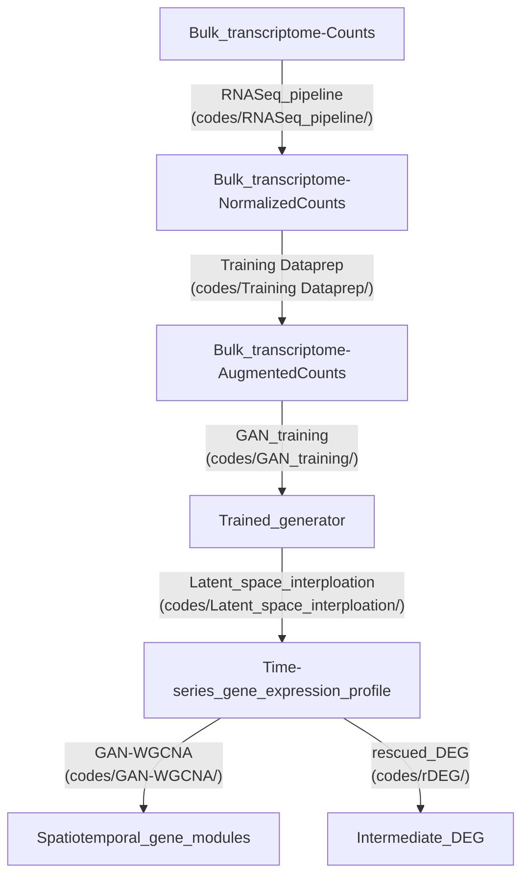

# GAN-WGCNA

## Publication
GAN-WGCNA: calculating gene modules as a way to find key intermediate regulators in cocaine addiction

## Workflow


## Environments
Analytic scripts are written in python(jupyter notebook) and R. Therefore, installation of interpreter for each language is required. Here is some installation guid
- `Python (Jupyter notebook)`: https://jupyter.org/install and https://docs.anaconda.com/anaconda/install/index.html
- `R (RStudio)`: https://posit.co/products/open-source/rstudio/
- `Tensorflow (version 1.15)`: We need tensorflow 1.15. Easiest way to installing tensorflow 1.xx is using anaconda distribution
```bash
python -m pip install --upgrade pip
conda create -n tensorflow python=3.7
activate tensorflow
pip install tensorflow==1.15.0
```
- `git-lfs` has been used for managing large files  [installation guid](https://github.com/git-lfs/git-lfs/wiki/Installation)
```bash
# To download file
git lfs pull
```

## RNASeq_pipeline
RNAseq pipeline consisted with two script `1_RNASeq_Dataset_Downloader.ipynb` and `2_Save_Voom_Analysis_Result.R`
- `1_RNASeq_Dataset_Downloader.ipynb` (Optional) if you want to download metadata from pubmed
- `2_Save_Voom_Analysis_Result.R` used for normalizing count dataset into rpkm and voom unit

## Training Dataprep
Training Dataprep consisted with two script `1_Data_Augmentation_and_Visualization.ipynb` and `2_Generate_Training_Input_Data.ipynb`
- `1_Data_Augmentation_and_Visualization.ipynb`  create augmented dataset (10-fold linear interpolation)
- `2_Generate_Training_Input_Data.ipynb` create training dataset from augmented result

## GAN_training
GAN_training contains several scripts but executing `2_main.py` is enough for training
```bash
# previous generated environment
activate tensorflow
# change dataset and gexsize for each region training
python 2_main.py --dataset BLA --gex_size 13557
# gex_size for each region
# VTA: 13317
# CPU: 13022
# HIP: 13176
# PFC: 13092
# NAC: 13232
```

## Latent_space_interploation
`Perturbation_simulation.ipynb` creates time-series profiles using training results in `GAN_training` (`checkpoints` are generated after training)
- `Perturbation_simulation.ipynb` creates `{region}_profile.npy` from specific epoch and datapoint, average it desired scale for further analysis and place it into `GAN-WGCNA/Dataset/{region}_sample_averaged_profile.csv`
- Because of storage limit, `checkpint` which is trained generator is not available on this repository. but it can be generated from `2_main.py`

## GAN-WGCNA
GAN-WGCNA has `script.R` and `Figures.ipynb`
- `script.R` creates Results
- `Figures.ipynb` draws figures based on Results
- `{group}_module` are manually downloaded Gene Ontology results from [Webgestalt](https://www.webgestalt.org/)

```r
sessionInfo() 
R version 4.2.0 (2022-04-22 ucrt)
Platform: x86_64-w64-mingw32/x64 (64-bit)
Running under: Windows 10 x64 (build 19045)

Matrix products: default

locale:
[1] LC_COLLATE=Korean_Korea.utf8  LC_CTYPE=Korean_Korea.utf8    LC_MONETARY=Korean_Korea.utf8
[4] LC_NUMERIC=C                  LC_TIME=Korean_Korea.utf8    

attached base packages:
[1] stats4    stats     graphics  grDevices utils     datasets  methods   base     

other attached packages:
 [1] biomaRt_2.52.0        edgeR_3.38.4          hash_2.2.6.2          phytools_1.5-1        maps_3.4.1           
 [6] reshape2_1.4.4        GOstats_2.62.0        graph_1.74.0          Category_2.62.0       Matrix_1.4-1         
[11] plyr_1.8.8            org.Mm.eg.db_3.15.0   ape_5.7-1             RFLPtools_2.0         RColorBrewer_1.1-3   
[16] jpeg_0.1-10           png_0.1-8             AnnotationDbi_1.58.0  IRanges_2.30.1        S4Vectors_0.34.0     
[21] Biobase_2.56.0        BiocGenerics_0.42.0   ggplot2_3.4.1         WGCNA_1.72-1          fastcluster_1.2.3    
[26] dynamicTreeCut_1.63-1 limma_3.52.4         

loaded via a namespace (and not attached):
  [1] colorspace_2.1-0        htmlTable_2.4.1         XVector_0.36.0          base64enc_0.1-3        
  [5] rstudioapi_0.14         optimParallel_1.0-2     bit64_4.0.5             fansi_1.0.4            
  [9] xml2_1.3.3              codetools_0.2-18        splines_4.2.0           mnormt_2.1.1           
 [13] doParallel_1.0.17       cachem_1.0.7            impute_1.70.0           knitr_1.42             
 [17] Formula_1.2-5           annotate_1.74.0         dbplyr_2.3.2            cluster_2.1.3          
 [21] GO.db_3.15.0            BiocManager_1.30.20     compiler_4.2.0          httr_1.4.5             
 [25] backports_1.4.1         fastmap_1.1.1           cli_3.6.1               prettyunits_1.1.1      
 [29] htmltools_0.5.5         tools_4.2.0             igraph_1.4.1            coda_0.19-4            
 [33] gtable_0.3.3            glue_1.6.2              GenomeInfoDbData_1.2.8  clusterGeneration_1.3.7
 [37] dplyr_1.1.1             rappdirs_0.3.3          fastmatch_1.1-3         Rcpp_1.0.10            
 [41] vctrs_0.6.1             Biostrings_2.64.1       preprocessCore_1.58.0   nlme_3.1-157           
 [45] iterators_1.0.14        xfun_0.38               stringr_1.5.0           lifecycle_1.0.3        
 [49] phangorn_2.11.1         XML_3.99-0.14           zlibbioc_1.42.0         MASS_7.3-57            
 [53] scales_1.2.1            hms_1.1.3               parallel_4.2.0          RBGL_1.72.0            
 [57] expm_0.999-7            curl_5.0.0              memoise_2.0.1           gridExtra_2.3          
 [61] rpart_4.1.16            stringi_1.7.12          RSQLite_2.3.0           genefilter_1.78.0      
 [65] plotrix_3.8-2           foreach_1.5.2           checkmate_2.1.0         filelock_1.0.2         
 [69] GenomeInfoDb_1.32.4     rlang_1.1.0             pkgconfig_2.0.3         matrixStats_0.63.0     
 [73] bitops_1.0-7            evaluate_0.20           lattice_0.20-45         htmlwidgets_1.6.2      
 [77] bit_4.0.5               tidyselect_1.2.0        GSEABase_1.58.0         AnnotationForge_1.38.1
 [81] magrittr_2.0.3          R6_2.5.1                generics_0.1.3          Hmisc_5.0-1            
 [85] combinat_0.0-8          DBI_1.1.3               pillar_1.9.0            foreign_0.8-82         
 [89] withr_2.5.0             scatterplot3d_0.3-43    survival_3.3-1          KEGGREST_1.36.3        
 [93] RCurl_1.98-1.12         nnet_7.3-17             tibble_3.2.1            crayon_1.5.2           
 [97] utf8_1.2.3              BiocFileCache_2.4.0     rmarkdown_2.21          progress_1.2.2         
[101] locfit_1.5-9.7          grid_4.2.0              data.table_1.14.8       blob_1.2.4             
[105] Rgraphviz_2.40.0        digest_0.6.31           xtable_1.8-4            numDeriv_2016.8-1.1    
[109] munsell_0.5.0           quadprog_1.5-8     
```

## rDEG
rDEG has `script.R` and `Figures.ipynb`
- `script.R` creates Results
- `Figures.ipynb` draws figures based on Results
- Because of storage limit, `{DATE}_{REGION}_{EPOCH}_epoch_profile_full_concated.npy` are not available on this repository. but it can be generated from `Perturbation_simulation.ipynb`

## Reference
- Park J, Kim H, Kim J, Cheon M (2020) A practical application of generative adversarial networks for RNA-seq analysis to predict the molecular progress of Alzheimer's disease. PLOS Computational Biology 16(7): e1008099. https://doi.org/10.1371/journal.pcbi.1008099
