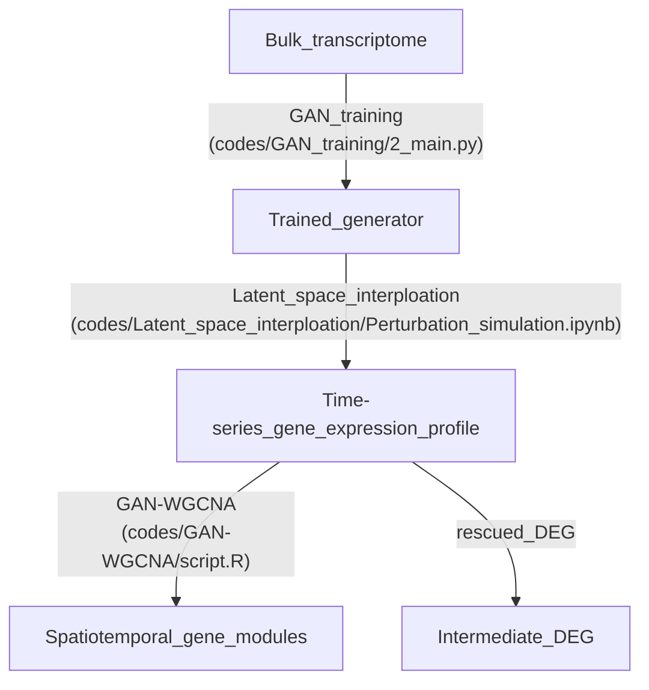

# GAN-WGCNA

## Publication
### GAN-WGCNA: calculating gene modules as a way to find key intermediate regulators in cocaine addiction
#### Workflow

```mermaid
graph TD;
    Bulk_transcriptome -- "GAN_training<br/>(codes/GAN_training/2_main.py)" --> Trained_generator
    Trained_generator -- "Latent_space_interploation<br/>(codes/Latent_space_interploation/Perturbation_simulation.ipynb)" --> Time-series_gene_expression_profile;
    Time-series_gene_expression_profile -- "GAN-WGCNA</br>(codes/GAN-WGCNA/script.R)" --> Spatiotemporal_gene_modules;
    Time-series_gene_expression_profile -- rescued_DEG --> Intermediate_DEG;

```
## Reference
- Park J, Kim H, Kim J, Cheon M (2020) A practical application of generative adversarial networks for RNA-seq analysis to predict the molecular progress of Alzheimer's disease. PLOS Computational Biology 16(7): e1008099. https://doi.org/10.1371/journal.pcbi.1008099
